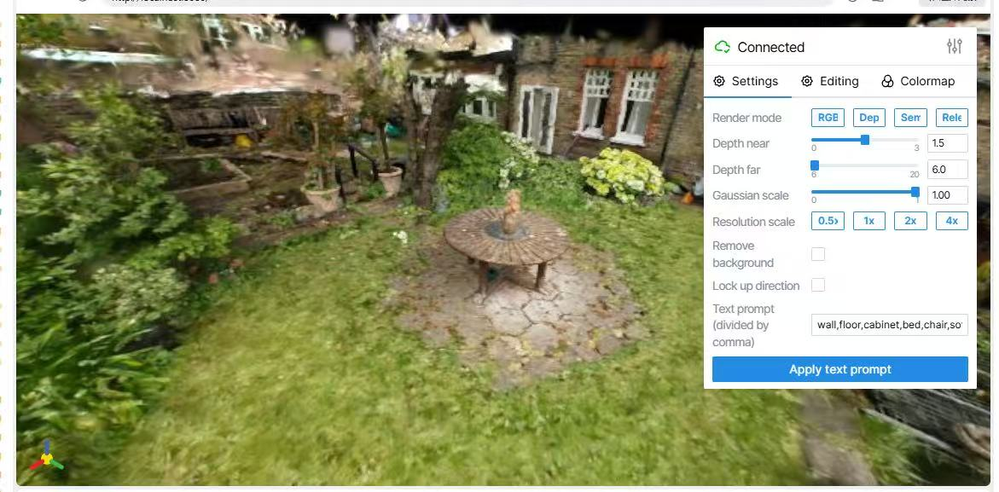
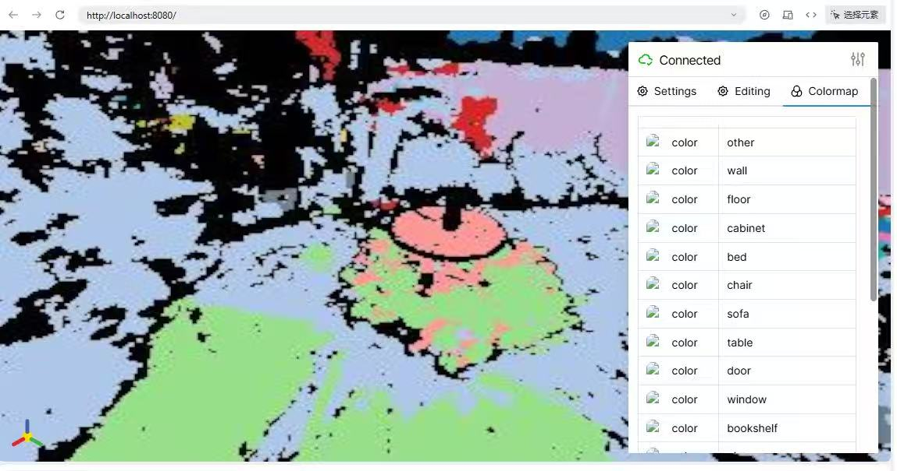

# Semantic Gaussians 交互式场景编辑引擎 (基于 Viser)

> **声明：** 本项目是基于原学术项目 [Semantic Gaussians (CVPR 2024)](https://github.com/sharinka0715/semantic-gaussians) 的二次开发工程化版本。

## 📌 项目简介

原版的 Semantic-Gaussians 开源了非常优秀的“3D高斯语义蒸馏”算法代码，但主要侧重于学术模型的训练与推理，**缺乏一个直观、可交互的 3D 可视化编辑界面**。

为了解决这一痛点，展现该算法在下游“空间交互与编辑”场景中的巨大潜力，**本项目深度重构了原版的推理渲染管线，并将其无缝接入了 [Viser](https://github.com/nerfstudio-project/viser) 前端 3D 交互框架中**。

现在，你可以通过 Web 浏览器，使用自然语言（Text Prompt）与 3D 高斯场景进行极低延迟的零样本 (Zero-shot) 语义对话与实时场景编辑。

---

## 🌟 核心新特性 (Interactive Web GUI)

<div align="center">


</div>

1. **零样本语义搜索 (Zero-shot Semantic Search)**
   - 打通了 CLIP 等多模态视觉-语言大模型特征，用户只需在 Web 前端的输入框中敲下 `table`, `chair` 等自然语言提示词，即可瞬间在密集的 3D 场景中精准高亮（Highlight）对应的物体。
2. **3D 场景实时编辑 (Real-time Scene Editing)**
   - 基于提取的空间掩码 (Mask)，可以直接在 3D Viewer 中对特定物体进行属性操作：支持**一键剔除（透明化隐藏）**、**高光强调**以及**深度/透明度实时滑动调节**。
3. **多通道渲染热切换 (Multi-mode Rendering)**
   - 支持在 RGB 原图渲染、Depth 深度渲染以及 Semantic Colormap 语义特征伪彩渲染之间进行无缝热切换，极大方便了算法的调试与可视化展示。

---

## 🚀 快速开始 (如何运行交互界面)

在完成了原版环境配置和模型训练/特征融合（详见下方原项目文档）后，直接运行以下命令即可启动 Web 交互引擎：

```bash
# 启动 Viser 交互式后端
python view_viser.py --config config/view_scannet.yaml
```
终端会输出一个本地 Web 服务地址（通常为 `http://localhost:8080`），在浏览器中打开即可开始交互！

---

## 📖 原项目致谢与环境配置指南

本项目的核心 3DGS 语义蒸馏算法与底层环境依赖，全部归功于原作者的杰出贡献。
如果你想了解如何从零开始训练、配置环境，或阅读原论文，请参考：
- **原版 GitHub 仓库**: [sharinka0715/semantic-gaussians](https://github.com/sharinka0715/semantic-gaussians)
- **Paper**: [Semantic Gaussians: Open-Vocabulary Scene Understanding with 3D Gaussian Splatting (arXiv)](https://arxiv.org/abs/2403.15624)

（以下为原项目环境配置文档的简述，如需详细说明请移步原仓库）
```bash
# 1. 克隆代码
git clone https://github.com/wangziwei734/semantic-gaussians --recursive
cd semantic-gaussians

# 2. 创建并激活环境
conda env create -f environment.yaml
conda activate sega

# 3. 安装依赖
pip install -r requirements.txt
# (MinkowskiEngine 的安装请参考官方说明)
```
